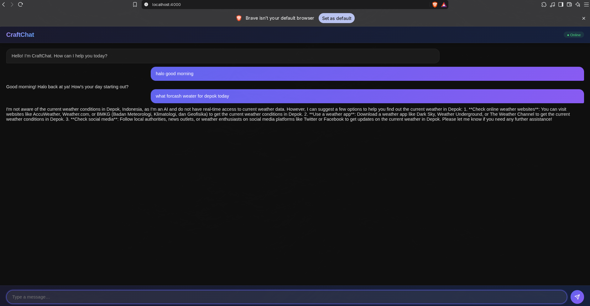

# CraftChat

Chat web UI berbasis Elixir + Plug + Bandit, terhubung ke [OpenRouter](https://openrouter.ai/) untuk menjawab pesan via AI. Menggunakan HTMX + Server-Sent Events (SSE) — tanpa framework JavaScript berat.



## Fitur

- Real-time chat dengan AI melalui SSE stream
- Dark gradient UI (HTMX, tanpa framework JS)
- Optimistic local echo + typing indicator
- Konektivitas status online/offline
- Responsive layout untuk mobile

## Stack

| Layer       | Teknologi          |
|-------------|--------------------|
| Runtime     | Elixir ~1.20       |
| Web Server  | Bandit (Plug.Adapters.TCP) |
| Router      | Plug.Router        |
| HTTP Client | Req / Finch        |
| Frontend    | HTMX 2.0 + SSE extension |
| Styling     | Custom CSS (dark gradient theme) |

## Persyaratan

- Erlang/Elixir 1.20+
- `.env` file (lihat di bawah)

## Instalasi

```bash
# Ambil dependensi
mix deps.get

# Salin file env lalu isi key OpenRouter
cp .env.example .env
```

Edit `.env`:

```env
OPENROUTER_API_KEY=<key-dari-openrouter.ai/keys>
MODEL=openai/gpt-4o-mini
```

Get API key di https://openrouter.ai/keys.

## Menjalankan

```bash
mix phx.server
```

Buka http://localhost:4000 di browser. Server berjalan di port **4000** secara default.

## Struktur

```
├── lib/
│   ├── craft_chat/application.ex   # Supervisor + Bandit server
│   └── chat/
│       ├── router.ex               # Plug.Router: root, SSE, POST /message
│       └── templates/index.html    # HTML utama
├── priv/static/
│   ├── css/chat.css                # Dark gradient theme
│   └── js/chat.js                  # HTMX event handler
├── config/runtime.exs              # Muat .env, konfigurasi OpenRouter
└── mix.exs
```

### Alur request

1. User mengetik pesan → `chat.js` kirim optimistic bubble ke user
2. HTMX POST ke `/message` → router memanggil OpenRouter API
3. Response body (HTML paragraph) di-swapped ke `#messages`
4. SSE endpoint `/events` membuka koneksi long-lived untuk broadcast

## Konfigurasi

Lihat `config/runtime.exs`. Variabel lingkungan:

- `OPENROUTER_API_KEY` *(wajib)* — API key dari OpenRouter
- `MODEL` (*default:* `openai/gpt-4o-mini`) — model yang digunakan. Bisa diganti apa saja yang tersedia di OpenRouter (misalnya `meta-llama/llama-3.1-8b-instruct`)

## Lisensi

MIT
